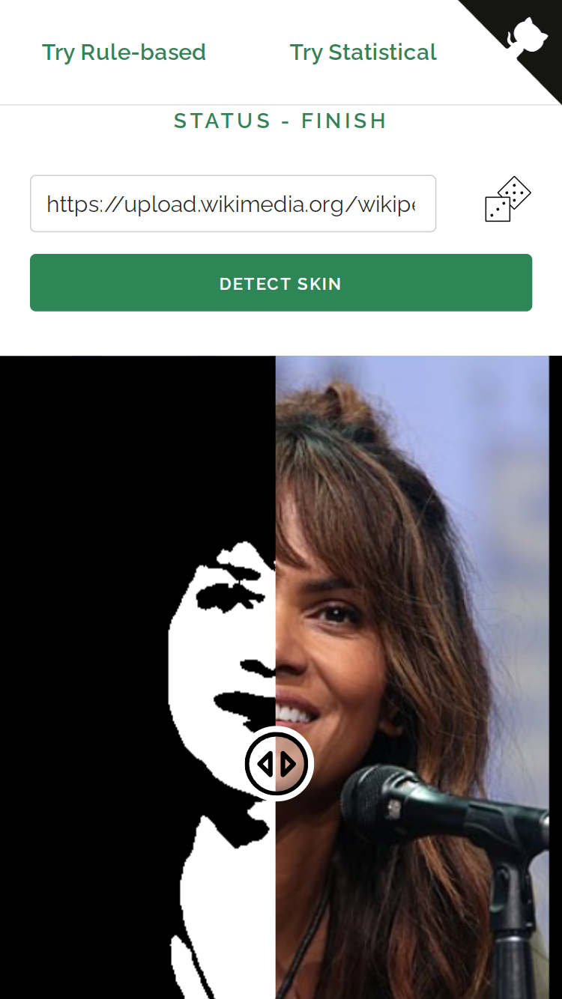
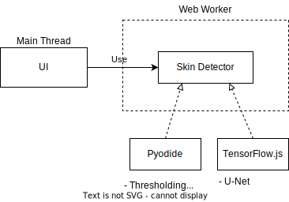

[py]: https://github.com/123mpozzi/nbrancati-py "see on GitHub"
[stat]: https://github.com/123mpozzi/skin-statistical "see on GitHub"
[unet]: https://github.com/123mpozzi/skinny "see on GitHub"
[pyodide]: https://github.com/pyodide/pyodide "see on GitHub"
[tfjs]: https://github.com/tensorflow/tfjs "see on GitHub"
[offscreencanvas]: https://caniuse.com/offscreencanvas "see feature support across browsers"

# Live Demo of Skin Detectors

 
<h3 align="center">
Skin detectors running directly in the browser  with no backend required
</h3>
 

 

  

 

###### ADAPTIVE THRESHOLDING
Demo of my [python implementation][py] of the original paper (Brancati et al. 2017)  
Running on: [Pyodide][pyodide]

###### STATISTICAL
Demo of the [statistical skin detector][stat] featured in my thesis (Acharjee 2018)  
Running on: [Pyodide][pyodide]

###### U-NET
Demo of the [u-net skin detector][unet] featured in my thesis (Tarasiewicz et al. 2020)  
Running on: [TensorFlow.js][tfjs]

## Architecture

 

  

 

###### NOTE
[OffscreenCanvas support][offscreencanvas] is needed to run WebGL acceleration in background (used by U-Net).  
I preferred to make the U-Net run on the main thread in case the browser does not support OffscreenCanvas because it should still get the WebGL acceleration, rather than running the U-Net in background using CPU, which is a lot slower. Hence the webpage may freeze in this case.

## Limitations

#### Slower
The python detectors runs in the browser thanks to Pyodide which work wonderfully, but has not yet reached the performance of native python.  
Therefore it is slower than the python implementation, and it must also load the Python distribution and packages before running.  

Regarding U-Net, TensorFlow.js speed depends on the backend, which is automatically picked by the library itself, but it is generally slower than the python implementation.

To mitigate high inference times, image size is limited to have the maximum dimension equal to 352px (while keeping aspect ratio) for python detectors, and 256x256 for U-Net, which should also permit running it on devices with little GPU memory.

#### Cross-Origin Resource Sharing
If the image at given URL is not hosted on the same website, it will not work and a random pre-defined image will be loaded instead.  
Also, local URLs (file://) do not work.
